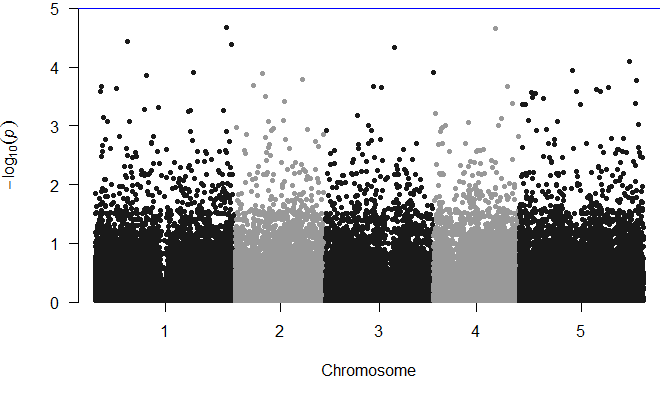
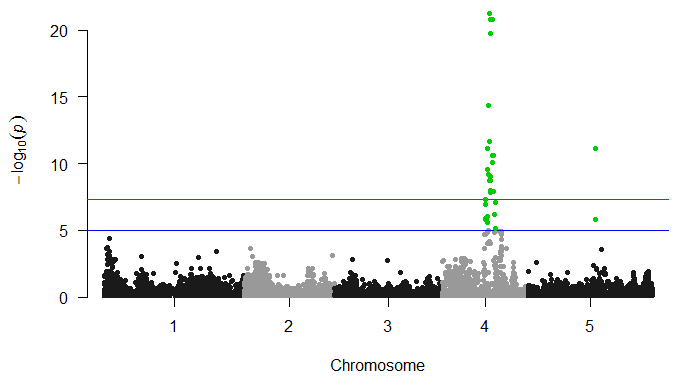

GWAS pipeline with GEMMA
=====

Simplified pipeline that requires from the user a VCF file with the samples of interest and a phenotype for each of the sample.

# Table of contents 
<div id='section-id-7'/>

- [On what platform can I work?](#section-id-7)
- [Softwares needed](#section-id-11)
- [Files needed](#section-id-24)
  - [VCF file preprocessing](#section-id-35)
    - [Subset the vcf file](#section-id-41)
    - [Remove unwanted chromosomes](#section-id-52)
    - [Keep alternative and biallelic positions only](#section-id-60)
    - [Remove indels and hide GT of individuals with low quality call](#section-id-68)
    - [Remove singletons](#section-id-83)
	- [Three-liners](#section-id-100)
    - [Compress and tabix the file](#section-id-117)
    - [Get list of accessions in vcf file:](#section-id-126)
  - [Phenotype file](#section-id-139)
- [Pipeline](#section-id-154)
  - [Use a covariate](#section-id-231)
- [Analysis in R](#section-id-250)
  - [User specific modifications](#section-id-274)
    - [process_chromatinJ_output.Rmd](#section-id-277)
    - [generate_phenotype_file.Rmd (for the output of chromatinJ pipeline)](#section-id-282)
    - [run_gwas_gemma.sh](#section-id-286)
    - [gemma_analysis.Rmd](#section-id-290)
- [Pipeline with ChromatinJ](#section-id-295)
- [Authors](#section-id-304)
- [License](#section-id-308)
 
# On what platform can I work?
This pipeline was developed on a GNU/Linux system. It should theoretically work on Mac OS X providing that the required softwares are installed properly.


<div id='section-id-11'/>

# Softwares needed
* Unix-like OS (Linux, Mac OS X, ...)
* Python 2.7 or 3.4
* R (>3.3.0) with the libraries indicated in the scripts
* Unix/Mac OS X environment for manipulation in bash
* p-link (v1.07)
* vcftools (v0.1.14)
* bcftools (v1.2)
* gemma (v0.94)

*NB: The versions indicated were the ones used and tested. One can first try already installed versions before installing the recommended version.*


<div id='section-id-24'/>

# Files needed
* VCF file with the accessions/samples (can be compressed with gzip or not)
* Text file containing the order of the accessions in the VCF file (`order_accession.txt`)
* File containing the phenotypes of interest with a column containing the name of the accession
as described in the vcf file. Alternatively, one can process directly a tsv file containing
the phenotype for interest with one value per row, with the same order than for the VCF file (no header)

**Note: The phenotype file should be in unix format and should not contain empty lines.**


<div id='section-id-35'/>

## VCF file preprocessing
Consider a VCF file containing 100 *Arabidopsis thaliana*, but the phenotype of only 80 accessions is available. The VCF file must then be first subset to these 80 accessions before being used in gemma. The VCF file input for GWAS should not contains indels, singletons, and keep only biallelic positions (non-alternative position can be removed to reduce file size). Also, the calls should be filtered by their quality for every individual, for instance a quality of minimum 25 (GQ>=25) and a coverage of minimum 3 reads (DP>=3) to keep the genotype for a certain SNP and individual (GT field in VCF).

I divide here the steps for the sake of clarity. Refer to [Three-liners](#section-id-100) to reduce the number of intermediary files and save CPU time.


<div id='section-id-41'/>

### Subset the vcf file
list file `list_accessions_to_keep.txt` contains the ID of each accession on separate rows. Note that subsetting is also possible with vcftools but takes about 8x longer. The same is true for other steps, bcftools always perform better.

```
bcftools -S list_accessions_to_keep.txt file.vcf.gz > subset_80.vcf
```

The output file will be `subset_80.vcf`


<div id='section-id-52'/>

### Remove unwanted chromosomes
Note: If you have chromosomes or organelle genomes to be excluded (mitochondria, chloroplasts, ...), you should remove them as they increase the number of SNPs to be tested and therefore decrease the threshold of significance (if Bonferroni correction is used for instance). In this case I want to keep only the 5 chromosomes of *A. thaliana*

```
bcftools view -r Chr1,Chr2,Chr3,Chr4,Chr5 subset_80.vcf > subset_80_only_chr.vcf
```


<div id='section-id-60'/>

### Keep alternative and biallelic positions only
A VCF file containing multiple samples can be quite heavy although most of the lines do not contain information relevant for GWAS (no alternative allele). One can therefore remove these positions to drastically reduce the size of the file, allowing faster processing in the next steps. Keep only positions with an alternative allele (--min-ac) and only biallelic positions (--max-alleles) (1 REF + 1 ALT) with this command:

```
bcftools view --min-ac=1 --max-alleles 2  subset_80_only_chr.vcf > subset_80_only_chr_biallelic_only_alt.vcf
```


<div id='section-id-68'/>

### Remove indels and hide GT of individuals with low quality call 
Two thresholds for coverage (DP) and genotype quality (GQ) are used within the [Hancock lab](https://github.com/HancockLab)

* Lenient: DP>=3 AND GQ>=25
* Stringent: DP>=5 AND GQ>=30

Depending on the stringency required, one can choose either of these thresholds.

```
bcftools -V indels -i 'MIN(FMT/DP)>2 & MIN(FMT/GQ)>24' subset_80_only_chr_biallelic_only_alt.vcf > subset_80_only_chr_biallelic_only_alt_DP3_GQ25.vcf
```

Note that gemma does not consider SNPs with missingness above a certain threshold (default 5%). Therefore, if in this case one SNP has less than 4 GT values (5% of 80 samples) following the filtering for DP>=3 and GQ>=25, the SNP will be ignored. Alternatively, genotypes can be imputed using BIMBAM (Plink is used in this genotype). Refer to gemma [documentation]((http://www.xzlab.org/software/GEMMAmanual.pdf)).


<div id='section-id-83'/>

### Remove singletons

Generates out.singletons (positions of all singletons)

```
vcftools --singletons --vcf subset_80_only_chr_biallelic_only_alt_DP3_GQ25.vcf
```

Exclude singleton positions 

```
vcftools --vcf subset_80_only_chr_biallelic_only_alt_DP3_GQ25.vcf \
			--exclude-positions out.singletons --recode --recode-INFO-all \
			--out subset_80_only_chr_biallelic_only_alt_DP3_GQ25_no_singletons
```


<div id='section-id-100'/>

### Three-liners

Here the commands to run if you don't need all the intermediary VCF files

```
bcftools view -S list_accessions_to_keep.txt -r Chr1,Chr2,Chr3,Chr4,Chr5 --min-ac=1 --max-alleles 2 -V indels -i 'MIN(FMT/DP)>2 & MIN(FMT/GQ)>24' file.vcf.gz > subset_80_only_chr_biallelic_only_alt_DP3_GQ25.vcf

vcftools --singletons --vcf subset_80_only_chr_biallelic_only_alt_DP3_GQ25.vcf

vcftools --vcf subset_80_only_chr_biallelic_only_alt_DP3_GQ25.vcf \
             --exclude-positions out.singletons --recode --recode-INFO-all \
             --out subset_80_only_chr_biallelic_only_alt_DP3_GQ25_no_singletons
```


<div id='section-id-117'/>

### Compress and tabix the file

```
bgzip  subset_80_only_chr_biallelic_only_alt_DP3_GQ25_no_singletons.recode.vcf && \
			tabix subset_80_only_chr_biallelic_only_alt_DP3_GQ25_no_singletons.recode.vcf.gz 
```


<div id='section-id-126'/>

### Get list of accessions in vcf file:

```
$ bcftool query -l  subset_80_only_chr_biallelic_only_alt_DP3_GQ25_no_singletons.recode.vcf.gz > order_accession.txt
$ cat order_accession.txt
1001
1002
1003

```


<div id='section-id-139'/>

## Phenotype file

Example of content for phenotype file:

```
$ cat phenotype.tsv 
12.3
13.4
15.3
```
The value 12.3, 13.4, 15.3, ... being the height of the accessions 1001, 1002, and 1003, ..., respectively.

Note: remember to convert EOLs from dos to unix format if the phenotype file is prepared in Microsoft Excel or in general on a PC. The can be easily done with the following command in a unix system: `vim phenotype.tsv -c ":set ff=unix" -c ":wq"`.


<div id='section-id-154'/>

# Pipeline
Note that the GEMMA has many options which can be changed directly in [run_gwas_gemma.sh](run_gwas_gemma.sh) if needed. Refer to [GEMMA documentation](http://www.xzlab.org/software/GEMMAmanual.pdf) for more details. In this pipeline, a univariate linear mixed model performing a likelihood ratio test is used (argument `-lmm 2`). Minor allele frequency (MAF) threshold is set to 1% per default but can be changed to for instance 5% by adding the flag `-maf 0.05` when generating the matrix and when performing the linear model fitting.


1. Generate a dataframe with all the variables and order the accessions so that they match VCF sample order
2. Generate a file for one phenotype from the previously generated dataframe (`test_export_df.txt`)
3. Process the phenotype file with plink and gemma (`run_gwas_gemma.sh`). This step should be run directly into the directory containing the vcf file and the phenotype file.
4. Import in R the output `phenotype.assoc.clean.txt` file to visualize GWAS results, see [gemma_analysis.Rmd](gemma_analysis.Rmd)

* The part 1, 2, and 4 are done interactively in R (need to be adjusted according to the dataframe used)
* The part 3 is done in bash through the run_gwas_gemma.sh script. The only variables being the input vcf file used (change path in the script file) and the phenotype file given as first argument in command  line:
* The part 4 is done interactively in R


Run the pipeline using bash:

```
bash run_gwas_gemma.sh phenotype.tsv vcf_file.vcf.gz
```

The output file is created in the subdirectory `output/`, which is automatically created by gemma from the directory containing the input vcf file. The name of the output file is `phenotype.assoc.clean.txt`. Note that the file `phenotype.assoc.txt` is the direct output of gemma but cannot be loaded by the `qqman` package in R due to a wrong organization of the column.


In addition, 1 log files are generated

One log file named `phenotype.log` is generated in the same directory `output/` and contains the different parameters of the run. Example of log output:

```
LOG FILE

Command: run_gwas_gemma.sh CHH_genes_cluster6_subset_64.tsv subset_64_accessions_only_alt_wo_singletons_biallelic_only_wo_indels_minDP3_minGQ25.recode.vcf.gz
Phenotype file: CHH_genes_cluster6_subset_64.tsv
VCF file: subset_64_accessions_only_alt_wo_singletons_biallelic_only_wo_indels_minDP3_minGQ25.recode.vcf.gz
Output file: /srv/biodata/dep_coupland/grp_hancock/johan/GWAS/dna_methylation/output/CHH_genes_cluster6_subset_64.assoc.clean.txt
Run finished on Fri Nov 16 13:16:58 CET 2018
Total time of the run: 13 seconds

> Log output from GEMMA:
> ##
> ## GEMMA Version = 0.94
> ##
> ## Command Line Input = -bfile subset_64_accessions_only_alt_wo_singletons_biallelic_only_wo_indels_minDP3_minGQ25 -k /srv/biodata/dep_coupland/grp_hancock/johan/GWAS/dna_methylation/output/subset_64_accessions_only_alt_wo_singletons_biallelic_only_wo_indels_minDP3_minGQ25.cXX.txt -lmm 2 -o CHH_genes_cluster6_subset_64
> ##
> ## Summary Statistics:
> ## number of total individuals = 64
> ## number of analyzed individuals = 64
> ## number of covariates = 1
> ## number of phenotypes = 1
> ## number of total SNPs = 1566021
> ## number of analyzed SNPs = 17175
> ## REMLE log-likelihood in the null model = -114.18
> ## MLE log-likelihood in the null model = -114.937
> ## pve estimate in the null model = 0.848988
> ## se(pve) in the null model = 0.0639243
> ## vg estimate in the null model = 10.6163
> ## ve estimate in the null model = 0.73981
> ## beta estimate in the null model =   5.19004
> ## se(beta) =   0.107515
> ##
> ## Computation Time:
> ## total computation time = 0.204333 min
> ## computation time break down:
> ##      time on eigen-decomposition = 0 min
> ##      time on calculating UtX = 0.0015 min
> ##      time on optimization = 0.0626667 min
> ##

```


More details about the run is also displayed as standard output when running `run_gwas_gemma.sh` and can be redirected to a log file if needed.
```
bash run_gwas_gemma.sh phenotype.tsv vcf_file.vcf.gz > log.txt
```


<div id='section-id-231'/>

## Use a covariate
A strong peak can hide other peaks. In this case, the potential causative SNP in the peak can be used as covariate and the GWAS can be run again to assess what is the weight of the other SNPs when the covariate SNP weight is removed from the analysis.
To do so one needs to generate a file with 2 columns, the first containings 1s and the second a code for the SNP to use as covariate. For example, if the SNP can be coded as 1 and the reference allele as 0, therefore, a set of 4 accessions were only the 2 first accessions have the SNP would yield a covariate file looking like this:

```
$ cat covariate_file.txt
1	1
1	1
1	0
1	0
```

This file can then be used as third argument in run_gwas_gemma.sh such as:

```
bash run_gwas_gemma.sh phenotype.tsv vcf_file.vcf.gz covariate_file.txt
```


<div id='section-id-250'/>

# Analysis in R

The output file `phenotype.assoc.clean.txt` generated by gemma can be imported in R and plotted using qqman package. See the example in [gemma_analysis.Rmd](gemma_analysis.Rmd). Note that if a covariate file was used, the output file names will contain the name of the covariate file as suffix to distinguish them from the files generated with the same phenotype input but without covariate.  


An example of GWAS plot would look like this:



In this case, no SNP has a p-value above the threshold of -log10(10E-5) (indicated by the blue line). 



In this case, a clear peak is visible in chromosome 4 and 5. The SNPs above the blue line threshold are highlighted in green. The blue line "suggestive line" (-log10(1e-5)) and the red line "genome-wide line" (-log10(5e-8)) are default in qqman and can be removed by setting `suggestiveline=FALSE, genomewideline=FALSE` in the plot command.

To know more about the qqman package:

* https://www.biorxiv.org/content/early/2014/05/14/005165.full.pdf+html
* https://cran.r-project.org/web/packages/qqman/qqman.pdf
* https://github.com/stephenturner/qqman


<div id='section-id-274'/>

## User specific modifications


<div id='section-id-277'/>

### process_chromatinJ_output.Rmd
-Indicate path of the ChromatinJ output results files
-Indicate path to file containing the order of the accessions from the VCF file


<div id='section-id-282'/>

### generate_phenotype_file.Rmd (for the output of chromatinJ pipeline)
-Change the path of the file to import and indicate which phenotype is wanted and which name for this phenotype should be given


<div id='section-id-286'/>

### run_gwas_gemma.sh
-Provide the two arguments (phenotype file and VCF file). Note that the two input files should be located in the same directory.


<div id='section-id-290'/>

### gemma_analysis.Rmd
-Change dir_file and file.name variables


<div id='section-id-295'/>

# Pipeline with ChromatinJ
If GWAS is to be performed in ChromatinJ output:
1. Generate a dataframe with all the variables and order the accessions so that they match VCF sample order with the R script process_chromatinJ_output.R (see example output file test_export_df.txt in directory 'examples')
2. Generate a file for one phenotype from the previously generated dataframe (test_export_df.txt) with the R script generate_phenotype_file.Rmd. The output is a file with a single column (no header) containing the phenotype of interest, scaled or not. See example files unscaled "Area_nucleus.tsv"
3. Process the phenotype file with plink and gemma (run_gwas_gemma.sh). This step should be run directly into the directory containing the vcf file and the phenotype file.
4. Import in R the output phenotype.assoc.clean.txt file to visualize GWAS results (script gemma_analysis.Rmd)


<div id='section-id-304'/>

# Authors
* **Johan Zicola** - [johanzi](https://github.com/johanzi)


<div id='section-id-308'/>

# License
This project is licensed under the MIT License - see the [LICENSE](LICENSE) file for details


